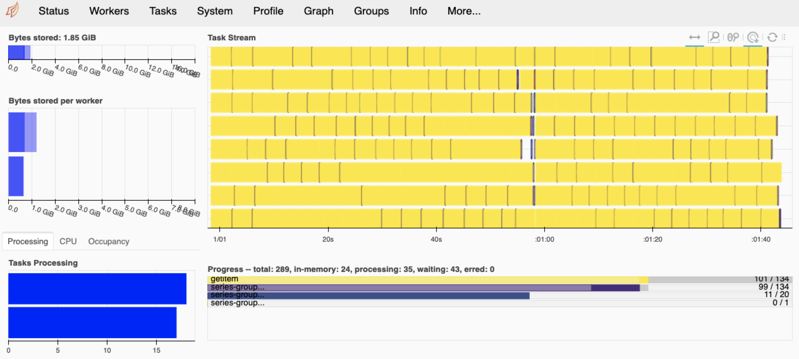

# Large Scale Computing (MACS 30123) Final Project

## Assessing the Effect of COVID-19 on Chicago Taxi Rides

While the COVID-19 Pandemic emerged in late 2019, it was around March 2020 that its impact started being felt the world over, with major countries announcing stay-at-home orders and restricting mobility. While most industries were hit hard due to the pandemic, the transit industry, especially individual taxi rides, and ridesharing, was hit the hardest.

This project aims to dig a bit deeper to understand what the exact numbers looked like concerning the reduction in rides and revenue and if any geospatial aspects were observed.

## Data

For this project, we will use the [City of Chicago's Taxi ride data](https://data.cityofchicago.org/Transportation/Taxi-Trips/wrvz-psew). The overall dataset contains details of all taxi rides in the city since 2013 and is kept up to date. Given the number of taxi rides over the years, this dataset contains 207M rows in total over ten years. We will focus our analysis on three years of data from **2019 through 2021** totalling around **18M rows.**

Such a massive amount of data cannot be processed on local machines, and we need to employ large-scale computing technologies to be able to analyze it. Specifically, the three years' worth of data from 2019-2021 totals **8GB** of data when stored as a CSV file.

While the Chicago Data Portal provides a way to filter for data from specific years when downloading data using `wget`, we will NOT use that method since it requires that we download the entire 8GB of data to our local before we can upload it onto AWS S3 for further analysis. Beyond the **obvious risks of data corruption and possible network issues, this method is inefficient**. Instead, we will use the below data pipeline for our analysis.

## Data Ingestion Pipeline

### Data Extraction

The Chicago Data Portal provides a way to access the Taxi ride data via the [Socrata API](https://dev.socrata.com/foundry/data.cityofchicago.org/wrvz-psew), which we will use to extract the data.

This extraction will be carried out using AWS Step Function on a State Machine invoking multiple Lambda functions concurrently to access the data portal via the API. Given that the maximum time for which a Lambda function can be active is 900s, we found that it is ideal for **extracting up to one week's worth of taxi ride data** per Lambda function. Over a span of 3 years from Jan-2019- to Dec-2021, this gives us 156 weeks. 

While ideally, we would concurrently be able to invoke 156 Lambda functions (which is much less than the concurrency limit of 1000), given the limitation of 50 concurrent runs for our current set-up, we invoke the Step Function 6 times - sequentially, each time focusing on concurrently extracting data for 26 weeks.

**Each invocation of the step function invokes 26 lambda functions concurrently, each of which extracts one week's worth of data and stores it as a CSV file in AWS S3**, with the corresponding year and week number added to the file name, to allow for sequential merge later.

The lambda function performing this data extraction is stored in [lambda_function.py](https://github.com/macs30123-s23/final-project-lsc_final_proj_vigneshv/blob/main/1_serverless_data_extraction/lambda_function.py). 
**NOTE:** The lambda function currently contains dummy values for the Socrata API Token, Username, and Password. Also, to access the Socrata API, the lambda function needs the [`sodapy`](https://pypi.org/project/sodapy/) package, which has been packaged in [my-deployment-package](https://github.com/macs30123-s23/final-project-lsc_final_proj_vigneshv/blob/main/1_serverless_data_extraction/my-deployment-package.zip).

The notebook with the code for setting up the entire pipeline is at [1_ChiTaxi_DataCollection_CDP_Lambda_SFN.ipynb](https://github.com/macs30123-s23/final-project-lsc_final_proj_vigneshv/blob/main/1_serverless_data_extraction/1_ChiTaxi_DataCollection_CDP_Lambda_SFN.ipynb)

### Data Collation

Once all 156 CSVs are stored in S3, we spin up a Spark EMR cluster to **read these CSVs into a Spark dataframe, merge them and write them into a single CSV file**.

Another option we have not explored in this project is to collate all the files into a single parquet file. A Parquet file, courtesy of its columnar storage, reduces the file size by 8 times and is read much faster by Dask in the next stage of the process.

The notebook with the code for setting up the entire pipeline is at [3_ChiTaxi_DataLoading_Spark.ipynb](https://github.com/macs30123-s23/final-project-lsc_final_proj_vigneshv/blob/main/2_data_exploration_and_loading_spark/3_ChiTaxi_DataLoading_Spark.ipynb)

**NOTE:** Before integrating all the individual CSVs, we also performed some preliminary exploratory data analysis and sanity checks on one of the CSVs. The code for this is at [2_ChiTaxi_DataExploration_pandas.ipynb](https://github.com/macs30123-s23/final-project-lsc_final_proj_vigneshv/blob/main/2_data_exploration_and_loading_spark/2_ChiTaxi_DataExploration_pandas.ipynb)

## Large-Scale Data Analysis

For analyzing the dataset of 3 years, we will use Dask, since it provides us with the convenience of using `pandas` methods. Since we use libraries such as `seaborn` and `geopandas`, we'd need to use the provided [bootstrap](https://github.com/macs30123-s23/final-project-lsc_final_proj_vigneshv/blob/main/3_visualization_dask/bootstrap) file to set up the Dask cluster.

For this project, we have looked at the below metrics to assess the effect of COVID-19 on Taxi rides:

### Average Trips per Month across three years

Strikingly, we can see the severe effect of stay-at-home orders starting in May on Taxi rides. **The rides plummeted from more than 0.8M per month to less than 0.05M per month in a span of 2 months.**

Even by the end of 2021, the number of rides per month only increased to a fraction of pre-pandemic levels topping out at less than 0.4M per month.

### Average Trips across the Day of Month and Hour of Day

These further indicate how drastic the number of rides reduced in 2020 and 2021. Additionally, the hour graph potentially hints at the effect of work-from-home since the **biggest drop in the ride numbers is for rides between 5 PM to 11 PM, most likely to be courtesy of commute back from work and night-life during the pre-pandemic period.**

### Number of Trips per Taxi Company

The Top-25 companies are severely hit post the onset of the pandemic, with very few able to continue strong operations in 2021. We see many companies, such as Chicago Carriage Cab Corp, Nova Taxi Affiliation Llc, and Taxi Affiliation Service Yellow, **completely cease operations by 2021.**

### Trip Totals by Payment Type

The **hypothesis for plotting this chart was that cash transactions would reduce significantly and witness a switch to contactless/card transactions due to the pandemic**. We do observe this to some extent with the increase in payments through Prcards; however, it appears that there isn't a severe drop away from cash towards contact-less payments, as the reduced numbers are largely courtesy of the reduced taxi rides.

### Map Density of Pickup Points

From the charts, we see that most rides are congregated around the Downtown area (and to some extent near O'Hare) and that even though there is a reduction in overall taxi rides, Downtown continues to witness much higher ridership than other neighborhoods in Chicago.

The code for the above analysis is at [4_ChiTaxi_DataViz_Dask.ipynb](https://github.com/macs30123-s23/final-project-lsc_final_proj_vigneshv/blob/main/3_visualization_dask/4_ChiTaxi_DataViz_Dask.ipynb)

## Future improvements to the project

While this project mainly focuses on data analysis, it is just the tip of the iceberg regarding expanding on this. Once the pipeline for the main taxi ride data has been created, additional data such as hospital locations, COVID-19 cases, and meteorological data like weather can be similarly included for more complex projects that use predictive methods.

## Reference

1. Socrata API:
    - [Queries using SODA](https://dev.socrata.com/docs/queries/)
    - [SoQL Function and Keyword Listing](https://dev.socrata.com/docs/functions/#,)
    - [Writing Socrata API data to CSVs](https://docs.python.org/3/library/csv.html)
2. AWS Lambda function and troubleshooting:
    - [Lambda `client` readTimeOut](https://github.com/boto/boto3/issues/2424)
    - [Lambda ephemral storage](https://aws.amazon.com/blogs/aws/aws-lambda-now-supports-up-to-10-gb-ephemeral-storage/)
    - [Splitting a list into parts](https://numpy.org/doc/stable/reference/generated/numpy.array_split.html)
    - [Deploying Python Lambda functions with .zip file archives](https://docs.aws.amazon.com/lambda/latest/dg/python-package.html)
3. Spark:
    - [Writing Spark DataFrame into Single CSV File - I](https://sparkbyexamples.com/spark/spark-write-dataframe-single-csv-file/)
    - [Writing Spark DataFrame into Single CSV File - II](https://mungingdata.com/apache-spark/output-one-file-csv-parquet/)
4. Dask:
    - [Connect to remote data](https://dask.pydata.org/en/latest/how-to/connect-to-remote-data.html)
    - [Reading CSV from S3](https://docs.dask.org/en/stable/generated/dask.dataframe.read_csv.html)
    - [Converting strings to datetime](https://docs.dask.org/en/stable/generated/dask.dataframe.to_datetime.html)
    - [Chicago Community Areas shapefile](https://data.cityofchicago.org/Facilities-Geographic-Boundaries/Boundaries-Community-Areas-current-/cauq-8yn6)
    - [Seaborn Styling](https://www.codecademy.com/article/seaborn-design-i)

